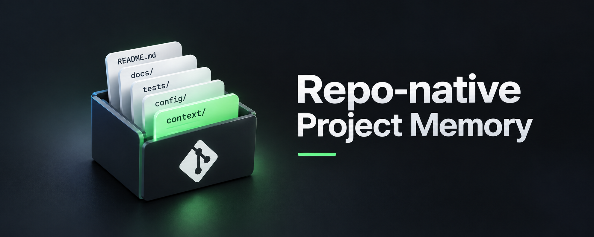

# Repo-native project memory

**Your repository already is your project's memory. One layer was missing.**

> Project memory is not another database for your coding agent. Your repository already is the project memory. AI just exposed the one thing it was systematically missing: why.

A repository is the one place a software project keeps the durable knowledge about itself: what it is, how to use it, how to build and test it, what changed, who may contribute how, under which terms. That layout has worked for decades, for people, without a platform. It works for AI coding agents too, for the same reason: it is plain files, next to the code, versioned by Git, readable by anything that can read a directory.

This page states a thesis, not a product: the repository is the project memory. A repository holds that knowledge; it becomes memory to the degree its layout makes it findable — an entry point, a place for each kind of knowledge, an index for the agent to load from. It needs no extra service, no account, no subscription. It already holds most of the durable knowledge needed to understand and change a codebase, for people and for agents alike. What it lacked is the layer that holds the reasoning worked out in AI sessions, the why, and that layer can be repo-native too.

## Three things that have held for twenty years

1. **Keep the durable knowledge in one place.** README, docs, tests, build scripts, changelog, license: one clone carries the repository-native knowledge of the project. Whoever has the clone has that knowledge — not every artifact a project ever produced, but the part that has to outlive any platform.
2. **Stay independent, open and simple.** Plain text, an open version control system, no vendor between you and your files. That is why a repository from 2006 still opens today, and why one from today will open in 2046.
3. **Whoever works on the project needs access to all of its knowledge.** That used to mean people. Now it means the coding agents too, and the classic layout already covers most of what they need.

## What a repository already remembers

| Element | The question it answers | Who reads it | Who maintains it today |
|---|---|---|---|
| `README.md` | What is this, should I care, how do I start | evaluators, new developers, agents on first contact | humans and agents |
| `docs/` | How do I configure, operate, troubleshoot | users, agents doing the work | humans and agents |
| `CHANGELOG.md` | What changed, in which version | upgraders, reviewers, agents reconstructing the past | humans and agents |
| `CONTRIBUTING.md` | How does a change get in, which conventions apply | contributors, agents about to change code | humans |
| `LICENSE`, `SECURITY.md`, `CODE_OF_CONDUCT.md` | Under which terms, how to report, how to behave | everyone | humans |
| `tests/` | What the code is supposed to do, executably | developers, CI, agents checking their own work | humans and agents |
| `pyproject.toml`, `package.json`, `Cargo.toml`, `composer.json`, … | What this depends on, how it is built and published | build tools, agents setting up | humans and agents |
| `AGENTS.md`, `CLAUDE.md` | Where an agent should look first, which conventions to follow | agents | humans, since 2025 |
| Git history | Who changed what, when, in which commit | everyone, if they dig | everyone, as a byproduct |

That is project memory, and it has been for a long time. Each row is a plain file or a Git object; each comes with the clone; each answers *what* and *how*. Issues and pull request discussions sit next to it as hosted collaboration memory — valuable, searchable, platform-bound, and not in the clone. Knowledge that matters for understanding or changing the project in the long run has to find its way back from those discussions into the repository, into one of the rows above.

## Why the question comes up now

Because coding agents have a memory problem, and it is not the one people usually name. An agent remembers what is in its context window. A new session starts from nothing: the explanation you gave yesterday is gone, the question you settled gets asked again, the turn you ruled out gets proposed again. That is session memory, and many of the products now sold as "project memory" are a response to it.

Take the memory an agent needs apart and it falls into three zones:

- **Personal knowledge** — who you are, how you like to work, what you never want to see again. This belongs to you, not to a project: a global note, an Obsidian vault, a Markdown file the agents on your machine can read.
- **General knowledge** — what the world knows. An agent does not have to hold it; like you, it can look it up.
- **Project knowledge** — what this project is, how it works, what changed, and why it is the way it is. This belongs in the project, and travels with it.

The third zone is the table above, and the table is nearly complete. Agents already maintain the README, the docs and the changelog, and they use them without being told to — the layout is established enough that coding agents understand what a `README.md` or a `CHANGELOG.md` is for. They know *what* the project does and *what* changed. What they cannot find anywhere is *why*: which alternatives were considered, which were rejected and for what reason, which workaround exists because of which incident, which constraint the code does not show. That reasoning is produced in every working session, in the conversation, and a new session throws it away.

> Session memory remembers what happened. Project state remembers where the project is. The why layer preserves why it became what it is.

## The missing layer, and where it goes

People had a mechanism for the why, for the few large decisions a year: Architecture Decision Records, written by hand, and most projects still have none. What was missing was an affordable mechanism for the hundred small reasons that actually make a codebase what it is — the retry loop that looks over-engineered, the flag a customer's proxy made necessary, the ordering constraint that looks safe to parallelize. Those lived in one person's head and left with that person, because writing each one down cost more than it seemed worth. Agents change that cost: the reasoning is spoken out loud anyway, and an agent that is in the conversation can write it down as a byproduct, synthesized, short, in a fixed form, committed together with the code it explains. Sometimes there is only a reason and no code, when a change was started and abandoned once the reason not to became clear. That is the case that matters most, because nothing else, no diff, no commit, no PR, would ever record it. It is also the case that has been measured: twenty fresh agent sessions on the same codebase, asked to simplify the same retry wrapper — without a recorded reason, seven of ten offered the already-rejected simplification again; with one `context/` entry, all ten found it and none did ([the experiment](https://blog.technopathy.club/what-happens-when-a-coding-agent-forgets-why-a-change-was-rejected), [transcripts and grades](https://github.com/oliver-zehentleitner/keep-the-why/tree/main/experiments/rejected-change)).

So the missing layer is one more directory:

| Element | The question it answers | Who reads it | Who maintains it |
|---|---|---|---|
| `context/` | Why is it built this way, what was tried and rejected | anyone about to change something, human or agent | agents in the session where the reason surfaces, confirmed by people |

It closes a natural gap instead of opening a new system. One honest difference to the other rows: `README.md` needs no special convention, coding agents already understand what it is for; `context/` is not an established convention yet, so for now an agent needs an explicit one — what goes there, in which form, when to ask first. That is what a skill like Keep the Why is: a convention and its implementation for the why layer, until the convention is as ordinary as a changelog. It lives where the rest already lives, is versioned by the same Git, travels with every clone and fork, shows up in the pull request beside the code diff where the reviewer needs it, and merges under the same review as the code. No extra layer to buy, no service to keep running, no account whose expiry takes the memory with it.

## The system, in five parts

Repo-native project memory is not one tool. It is a model for how durable project knowledge is organized: the README, docs, tests, configuration and history hold the *what* and *how*; `context/` holds the *why*; Git stores, versions, distributes and reviews all of it; the agent is the interface that captures and retrieves; Keep the Why is one convention and implementation for the why layer — your repository already is your project memory, Keep the Why fills the layer it was missing. In parts:

| Part | Role | What it is | Required? |
|---|---|---|---|
| **The repository** | stores, versions, distributes, reviews | Git, and the layout above | yes, and you already have it |
| **The agent** | the interface: captures, retrieves, asks | whichever coding agent you work with | yes, any that reads a `SKILL.md` or an `AGENTS.md` |
| **[Keep the Why](https://keepthewhy.com)**, the skill | integrates into the working session, synthesizes what is worth keeping into `context/` under clear rules, asks before it writes when unsure | instructions, in the open cross-agent skill format | it is the part that writes the why; without it, or something like it, the layer stays empty |
| **`keep-the-why-lint`** | checks and verifies the structure: fields, values, index, nothing hidden | a small Python package, in CI or run by the agent after it writes | no; nice to have the moment more than one person or agent writes |
| **`keep-the-why-dashboard`** | shows it: the graph, an entry with its Git history, what still needs a person | a read-only page over the files and Git, local or exported | no; the day-to-day work runs through the agent |

That is it. Task fulfilled, no further complexity. Anything beyond it, project management, dashboards for teams, workflows, can be built on top, and for a company that may be the right call. Open source should not have to depend on it. A project that drops every part except the repository loses nothing: the directory is still Markdown, still in Git, still readable.

## What repo-native means, as a checklist

- Plain files in the repository; nothing lives only in a service.
- Versioned and distributed by Git; no second synchronization problem.
- Readable by humans and by agents with no tool in between.
- Reviewed like code: in the pull request, next to the change it explains.
- No account, no subscription, no telemetry, no daemon, no database.
- Works without the optional parts; degrades to Markdown, not to nothing.

## What this is not

- Written by the author of one implementation. This page and [Keep the Why](https://keepthewhy.com) are by the same person, and the tool came first: it started as decision records for agents, and the broader view on this page is what building it taught. Read the thesis as the claim and the tool as one way to act on it — the claim holds with or without that implementation, and it would hold for another one.
- Not a replacement for issue trackers, project management or team workflows. Those manage work. This remembers why the code is what it is.
- Not a claim that agents replace the discipline of thinking, pruning and questioning that keeps any documentation honest. They lower the cost of writing it down; people still decide what is true.

## The page

This README is the canonical text. The same thesis, laid out, is at https://oliver-zehentleitner.github.io/repo-native-project-memory/ — two plain files in `docs/`, no build, no dependencies, no external requests.

## Where this is thin

The thesis is a diagnosis and a convention. It is not the whole solution, and four things are weaker than the headline sounds:

- **A repository holds knowledge; it is memory only to the degree the layout makes it findable.** For people the layout does that. For agents it does too, at the scale of a lean index and a few dozen topic files. At hundreds of entries, "what do I need to know about this subsystem right now" is a retrieval problem, and search over the files — full-text, an index, embeddings — becomes worth having. Repo-native and good search do not exclude each other; "no database" is a claim about where the knowledge lives, not a search strategy.
- **The layer stays empty without an agent that fills it, and activation is not guaranteed.** `context/` is not an established convention yet, so an agent has to be told about it; whether it then loads the instruction depends on the platform. Where that fails, the result is the old ADR failure: a good schema and an empty directory. That is exactly what the skill is for, and with it the layer does fill: the one implementation linked here measures its activation per release and per agent and publishes the misses — in the last measured series every session on a project that had opted in loaded it. Anyone adopting the layer with another tool should measure the same thing.
- **Structure can be checked; truth cannot.** A linter verifies fields, values and the index. It cannot tell a right reason from a confidently wrong one, and a wrong why that the next agent treats as fact is worse than none. That is why an entry carries how well its origin is known (confirmed, inferred, unknown), why writes can require a person's yes, and why "unknown" is a legal answer — the convention takes what can honestly be done with today's means and does not pretend to more. It still only helps if someone reads. Who confirms, who marks an entry superseded, who resolves a contradiction is work the convention names and does not remove. Extra Markdown in a pull request can be skimmed exactly like an ADR.
- **Much of the why never reaches the repository.** In real teams it lives in chat, tickets, wikis and heads. "Write it back" is the right rule and a process problem, not a file-format one; the convention makes the destination cheap to reach and gives an agent that is in the conversation a place to put what it heard. It does not reach the conversations the agent was not part of.

This is a documentation discipline with an agent as the writing hand, not a memory subsystem. It wins on ownership, review and longevity. It loses where activation fails, where nobody reads, where the repository is large, and for the knowledge that never gets written down. Read it as a thesis plus a convention, not as "the memory problem is solved."

## Where the idea comes from

None of this is a discovery. That the reasoning behind design decisions gets lost, and that writing it down costs more at the time than it visibly returns, has been studied in software engineering for decades — the design-rationale literature, and the architecture community's name for the loss, *knowledge vaporization* (Jansen and Bosch, 2005). [Architecture Decision Records](https://cognitect.com/blog/2011/11/15/documenting-architecture-decisions) (Nygard, 2011; [adr.github.io](https://adr.github.io/)) are the practical answer for the few large decisions, and research keeps finding the same gap below them: rationale that is obsolete or missing because of the imbalance between the cost of documenting it and its value to the person writing it ([arXiv:2405.19623](https://arxiv.org/abs/2405.19623)). Recent work on AI-assisted engineering adds the other half of the problem: decisions are now produced faster than teams can validate them, and something has to distinguish conjecture from verified knowledge ([arXiv:2601.21116](https://arxiv.org/abs/2601.21116)). What this page adds is small and specific. AI did not create the need for the why; it changed the economics of capturing it, because the reasoning is now spoken in the working session anyway — and the result has a natural home, a row in the repository next to the others.

## Discussion

The same argument as an article, for reading and sharing: [Your repository already is your project's memory. One layer was missing.](https://blog.technopathy.club/your-repository-already-is-your-project-s-memory-one-layer-was-missing)

Disagree, or see a layer this page misses? The place for that is the repository's [Discussions](https://github.com/oliver-zehentleitner/repo-native-project-memory/discussions) — arguments about the thesis, experiences from your own repositories, other conventions for the why layer. Corrections to the text are pull requests.

## Who

Oliver Zehentleitner — [GitHub](https://github.com/oliver-zehentleitner) · [blog](https://blog.technopathy.club) — maintainer of the [UNICORN Binance Suite](https://github.com/oliver-zehentleitner/unicorn-binance-suite) and author of [Keep the Why](https://keepthewhy.com), the implementation this page grew out of. This page is the thesis; Keep the Why is one practice for its why layer, and this repository keeps its own `context/` in that format, because the argument should hold for the page that makes it.

## License

[MIT](LICENSE)
